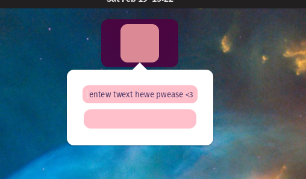

# Setup

## Dependencies

Install build dependencies:

```bash
sudo apt install libgtk-4-dev build-essential -y
```

Install rust (this will install the stable version of the Rust toolchain system wide):

```bash
curl --proto '=https' --tlsv1.2 -sSf https://sh.rustup.rs | sh -s -- -y
```

## Project layout and setup

First in order to setup the project, we need to clone the repository along side a few others.
Put them all in one directory of your choosing (without any nesting).

The dock application itself:

<https://github.com/pop-os/cosmic-dock-epoch>

COSMIC desktop library:

<https://github.com/pop-os/libcosmic>

The plugin itself:

<https://github.com/wash2/dock-plugin-uwu>

Clone them all:

```bash
git clone https://github.com/pop-os/cosmic-dock-epoch.git && \
git clone https://github.com/wash2/dock-plugin-uwu.git && \
git clone https://github.com/pop-os/libcosmic.git
```

The structure of your folder should look like this:

```bash
.
├── cosmic-dock-epoch
├── dock-plugin-uwu
└── libcosmic
```

## Configuration

In order for the dock/plugin to work it needs certain configuration and configuration files to be
present on the system. First create `~/.local/lib` directory, it will store `.so` (shared object)
files that the dock and the plugin will compile into:

```bash
mkdir ~/.local/lib
```

This directory should be available for the dock under `LD_LIBRARY_PATH` system environment variable.
Add its definition to your shell configuration file, if you are using `bash` then its most likely
going to be `~/.bashrc`, if you are using `zsh` its going to be `~/.zshrc`. You can check which
shell you are using by running:

```bash
echo $SHELL
```

Append this line to the end of your shell configuration file:

```bash
export LD_LIBRARY_PATH="~/.local/lib"
```

You can easily append it by running this command:

For `.bashrc`:

```bash
echo 'export LD_LIBRARY_PATH="~/.local/lib"' >> ~/.bashrc
```

For `.zshrc`:

```zsh
echo 'export LD_LIBRARY_PATH="~/.local/lib"' >> ~/.zshrc
```

Then source your shell configuration file:

For `.bashrc`:

```bash
source ~/.bashrc
```

For `.zshrc`:

```zsh
source ~/.zshrc
```

The Dock itself uses a configuration file, in order to create it first create `~/.config/com.cosmic.dock2/`
directory and `settings.ron` file:

```bash
mkdir ~/.config/com.cosmic.dock2 && touch ~/.config/com.cosmic.dock2/settings.ron
```

This configuration will tell the Dock to use the plugin:

```text
(
    plugins: [
        "uwu_plugin",
    ],
    position: Top,
    scale: 1,
)
```

You can paste it there easily using this command:

```bash
echo -e '(
    plugins: [
        "uwu_plugin",
    ],
    position: Top,
    scale: 1,
)' >> ~/.config/com.cosmic.dock2/settings.ron
```

## Build and run

In order to build the plugin you first need to build the `libcosmic`.
Building the `libcosmic` library is pretty straight forward:

```bash
cd libcosmic && \
cargo build --release
```

Now navigate to the plugin:

```bash
cd .. && \
cd dock-plugin-uwu
```

The `dock-plugin-uwu` should be compiled with the `nightly` version of the Rust toolchain.
In order to do that you can set the plugins directory to use the nightly version as such:

```bash
rustup override set nightly
```

Now build the plugin, and copy the resulting `.so` object file into the `~/.local/lib` directory:

```bash
cargo build --release && cp target/release/libuwu_plugin.so ~/.local/lib/
```

Now build the COSMIC Dock (here, additionally you need to switch to the `plugin-refactor` branch)

```bash
cd .. && \
cd cosmic-dock-epoch && \
git switch plugin-refactor && \
cargo build --release
```

Now you can run the dock and the plugin should work as a part of it:

```bash
cargo run --release
```

The running dock:


